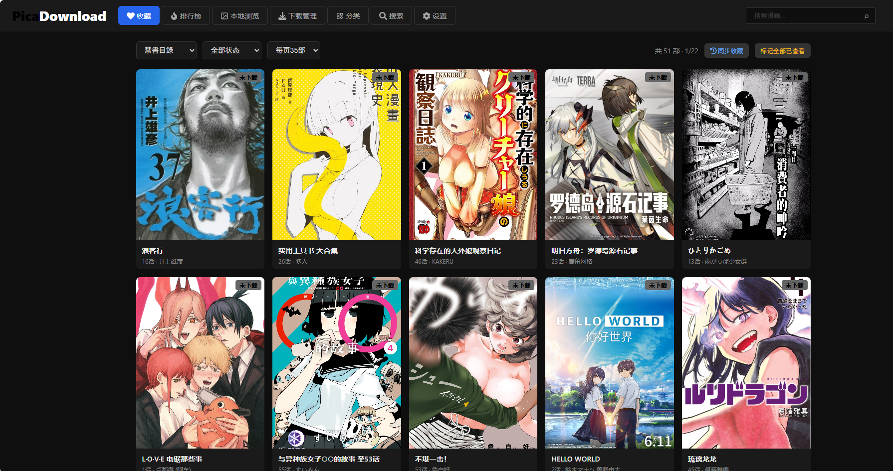
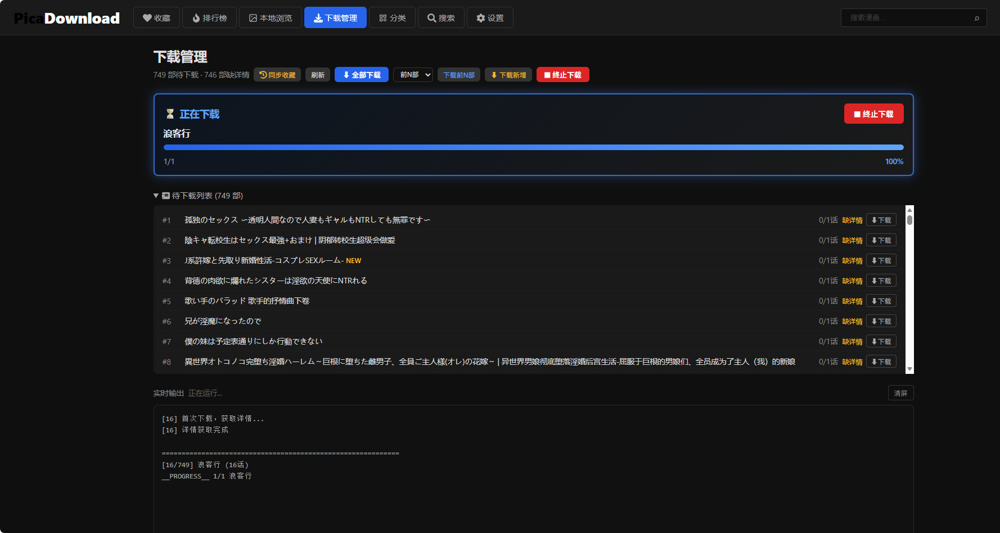
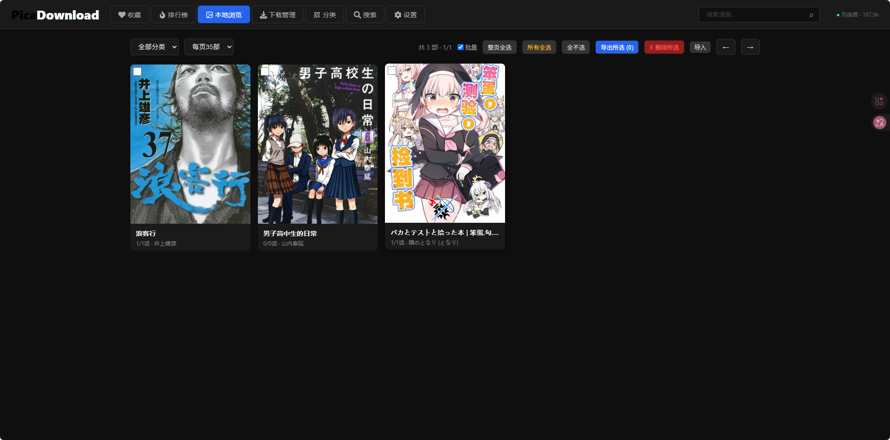
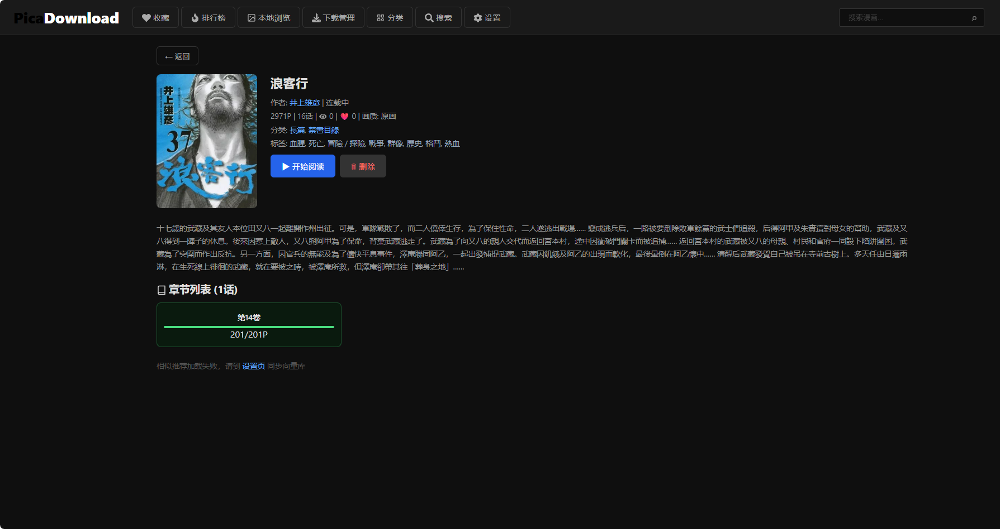
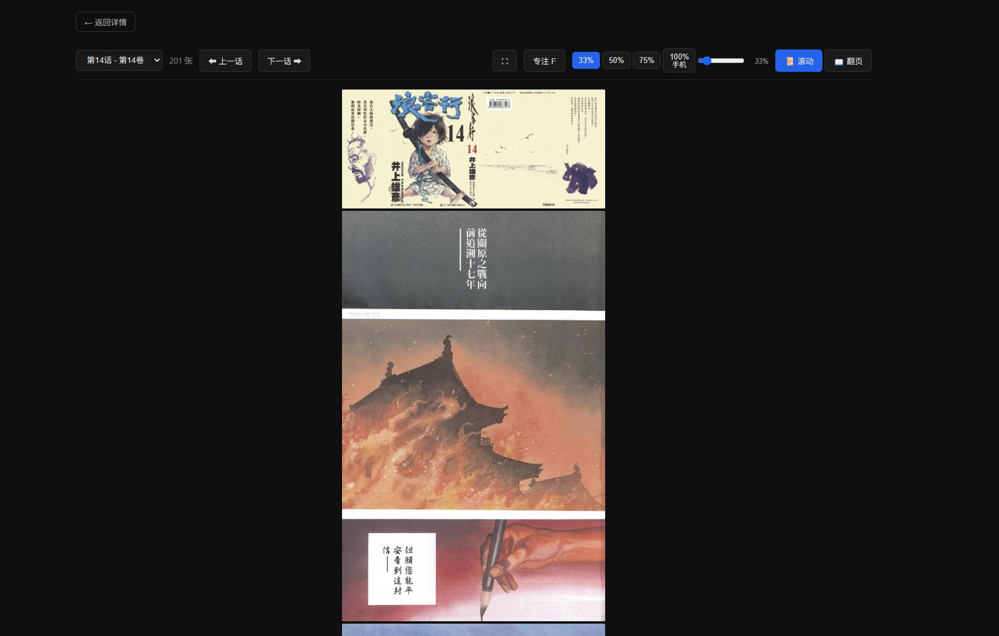
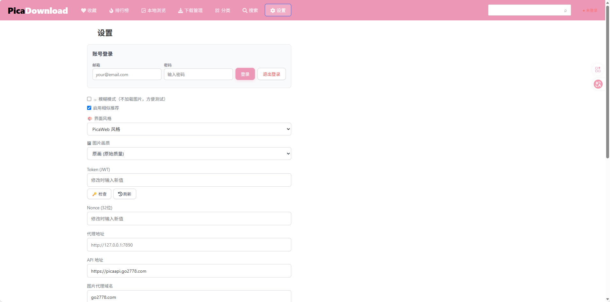
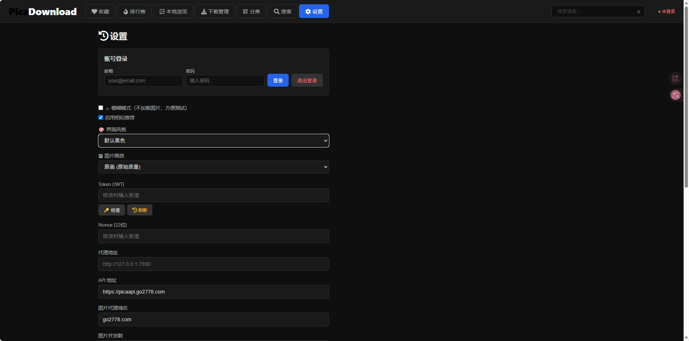

# PicaDownload

通过逆向工程的 API 签名算法调用哔咔漫画 Web API，实现收藏列表同步、漫画详情获取、图片批量下载和本地浏览。

## 图形化界面方便操作



## 一键并发下载（支持批量和单部下载），速度更快



## 本地管理导入导出



## 自带阅读，随下随看





### 专注模式及移动端界面


## 两种主题风格

### 哔咔网站颜色：



### 默认黑色：




## 安装

### 一、

release下载最新版本exe，一键运行

### 二、

**Windows** — 双击 `setup.bat`

**macOS / Linux** — 终端运行 `bash setup.sh`

脚本自动创建虚拟环境、安装依赖、复制配置文件。完成后编辑 `config.yaml` 填入凭证，启动 `python server.py`，浏览器访问 `http://localhost:8000`。

## 获取凭证

两种方式任选其一：

1. **浏览器提取**：登录 https://manhuapica.com → F12 → Application → Local Storage → 复制 `token` 和 `nonce` → 填入 `config.yaml`
2. **邮箱登录**（推荐）：启动后在设置页直接用邮箱密码登录，自动获取

## 功能

- **收藏同步** — 从 Pica API 实时拉取收藏列表，支持增量新增检测和 NEW 标签
- **一键收藏** — 排行榜等页面直接收藏漫画到账号
- **批量下载** — 三级并发（漫画/章节/图片），断点续传，自动跳过已下载
- **画质选择** — 支持标准/原画两种画质，本地详情页显示下载画质
- **本地浏览** — 网格视图、详情页、分类筛选、搜索、滚动/翻页阅读器
- **进度管理** — 实时下载日志（SSE 推送），全局+章节级双层进度追踪
- **批量管理** — 整页全选 / 所有全选，批量导出删除
- **排行榜** — Pica API 排行榜浏览（H24/D7/D30）
- **相似推荐** — 基于向量库的语义相似漫画推荐
- **导入导出** — 漫画打包 ZIP 导出/导入

## 使用

| 页面 | 功能 |
|------|------|
| 收藏页 | API 实时收藏列表，分类/状态下拉筛选，NEW 标签，页面跳转，标记已查看 |
| 下载页 | 待下载队列，已解析/缺详情状态，勾选批量下载，实时 SSE 日志 |
| 本地浏览 | 已下载漫画网格，分页浏览，批量模式（整页全选/所有全选） |
| 分类页 | 收藏/本地方切换，按标签分组浏览 |
| 搜索页 | 三源搜索（收藏 + 本地 + 导入） |
| 排行榜 | H24/D7/D30 排行榜，支持一键收藏 |
| 设置页 | Token/Nonce 配置，邮箱登录，画质选择，并发数调整，向量库管理 |

典型流程：**设置页配置凭证 → 收藏页刷新同步 → 下载页勾选启动 → 本地浏览阅读**

## 配置说明

所有配置均可在 Web 设置页面直接修改，也可手动编辑 `config.yaml`：

| 配置项 | 默认值 | 说明 |
|--------|--------|------|
| 邮箱 / 密码 | — | 登录自动获取 token 和 nonce |
| Token (JWT) | — | API 鉴权令牌 |
| Nonce | — | 签名随机数 |
| API 地址 | `https://picaapi.go2778.com` | Pica API 基础地址 |
| 图片代理域名 | `go2778.com` | 图片 CDN 域名 |
| 代理地址 | — | HTTP 代理，如 `http://127.0.0.1:7890` |
| 图片并发数 | `80` | 单话内并发下载数 |
| 章节并发数 | `1` | 同时下载的章节数 |
| 漫画并发数 | `1` | 同时下载的漫画数 |
| 最大重试次数 | `3` | API 请求失败重试上限 |
| 下载目录 | `comics_detail` | 漫画文件存储路径 |
| 图片画质 | `original` | `standard` 标准 / `original` 原画 |
| 界面风格 | 默认黑色 | PicaWeb 风格可选 |
| 模糊模式 | 关闭 | 开启后不加载图片，方便浏览目录 |
| 启用相似推荐 | `true` | 向量库语义搜索，不需要可关闭 |
| Embedding API Key | — | 阿里云 DashScope API Key |
| Embedding API 地址 | — | Embedding 服务地址，不填用默认 |

## 项目结构

```
.
├── server.py                  # FastAPI 启动入口
├── PicaScraper.spec           # PyInstaller 打包配置
├── app/                       # FastAPI 模块化架构
│   ├── main.py                # 应用工厂 + 路由注册
│   ├── dependencies.py        # 依赖注入容器
│   ├── core/                  # 签名算法、API客户端、文件工具、数据库
│   ├── services/              # 下载引擎、漫画浏览、收藏、认证、配置
│   ├── routers/               # REST API 端点
│   ├── repositories/          # 数据访问（JSON + SQLite）
│   └── models/                # Pydantic 请求/响应模型
├── frontend/                  # 纯 HTML/CSS/JS SPA（无框架）
│   ├── index.html             # 本地浏览
│   ├── favorites.html         # 收藏页
│   ├── download.html          # 下载管理（SSE 实时日志）
│   ├── settings.html          # 设置页
│   ├── detail.html            # 本地漫画详情
│   ├── detail-api.html        # API 漫画详情（收藏按钮/本地阅读入口）
│   ├── reader.html            # 图片阅读器
│   ├── categories.html        # 分类页
│   ├── leaderboard.html       # 排行榜页
│   └── search.html            # 搜索页
└── docs/                      # 文档
```

## API 端点

| 方法 | 路径 | 说明 |
|------|------|------|
| GET | `/api/comics` | 本地漫画列表（分类筛选、分页） |
| GET | `/api/comics/{folder}` | 漫画详情+章节（含本地下载状态） |
| GET | `/api/comics/{folder}/chapters/{order}` | 章节图片列表 |
| DELETE | `/api/comics/{folder}` | 删除漫画 |
| GET | `/api/favorites` | 实时收藏列表（分类/状态筛选） |
| POST | `/api/favorites/refresh` | 从 API 同步收藏 |
| POST | `/api/favourite` | 收藏漫画 |
| POST | `/api/mark-seen` | 标记已查看（全部或单个） |
| GET | `/api/download/queue` | 待下载队列 |
| POST | `/api/download/start` | 启动下载 |
| POST | `/api/download/stop` | 停止下载 |
| GET | `/api/download/status` | 下载状态 |
| GET | `/api/download/stream` | SSE 实时日志流 |
| GET/POST | `/api/config` | 配置读写 |
| POST | `/api/login` | 邮箱登录 |
| POST | `/api/logout` | 退出登录 |
| GET | `/api/search` | 三源搜索 |
| GET | `/api/categories/full` | 分类分组 |
| GET | `/api/leaderboard` | 排行榜 |
| GET | `/api/similar/{folder}` | 相似推荐 |
| POST | `/api/comics/export` | 导出 ZIP |
| POST | `/api/comics/import` | 导入 ZIP |

## 技术要点

- **签名算法**：HMAC-SHA256，密钥从 JS bundle 逆向提取
- **请求伪装**：Android App 请求头（`app-platform: android`），带 `origin`/`referer`
- **自动重试**：5xx 错误指数退避重试（2s/4s/8s/...上限 30s），最多 30 次
- **三层并发**：漫画级/章节级/图片级 worker pool，协程+队列控制并发数
- **断点续传**：文件存在 + 大小 > 0 判重，chapters.json 记录每话进度
- **SSE 推送**：下载日志实时推送到前端，支持心跳和断线重连

## 免责声明

1. 本工具仅供个人学习和技术研究使用，严禁用于商业用途或任何盈利行为，禁止利用本工具获取的资源进行二次分发或商业行为。
2. 使用本工具下载的漫画内容版权归原作者及哔咔漫画平台所有，请于下载后 24 小时内删除，如需长期保存请支持正版。
3. 过度高频的请求可能对哔咔漫画服务器造成压力甚至触发封禁，请合理设置并发数与请求延迟，使用者需自行承担账号风险。
4. 本工具不提供任何漫画内容，所有数据均来自用户自行配置的 API 凭证所关联的账号。
5. 使用者需遵守当地法律法规，因使用本工具产生的任何法律后果由使用者自行承担。
6. 如有侵权行为请联系删除，请勿将本工具用于公开传播。

## License

MIT
